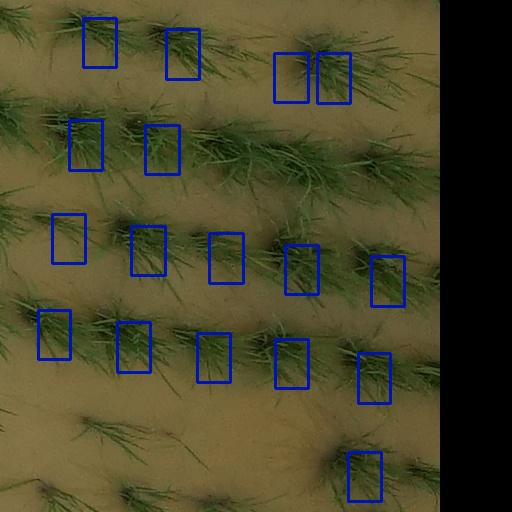

# RiceDetection
Efficientdet for Rice Detection  

### Detection 
- Efficientdet-D0 pytorch
- image size 3000x2000 -> pathc size 512x512

### Training Step
- patch images
- given bboxes by annations(center points) and labels in images.(reference [csvtojson_datasets.ipynb](csvtojson_datasets.ipynb) )
- observe given bboxes
- train efficientdet-d0 model (reference [train.py](train.py) )
- see models' results (reference [efficientdet_test_all_weights.py](efficientdet_test_all_weights.py) )

### Data and Result
original photo : <br />
 <br />
output photo : <br />
 <br />

- training step 1
```
$ python train.py -c 0 -p Rice --head_only True --lr 5e-3 --batch_size 16 --load_weights weights/efficientdet-d0.pth  --num_epochs 10 --save_interval 100
```
- training step 2
```
$ python train.py -c 0 -p Rice --head_only False --lr 1e-3 --batch_size 8 --load_weights ./logs/Rice/[last step best weight]  --num_epochs 300 --save_interval 500
```
- test
```
$ python efficientdet_test_all_weights.py
```

- ref : https://github.com/zylo117/Yet-Another-EfficientDet-Pytorch
